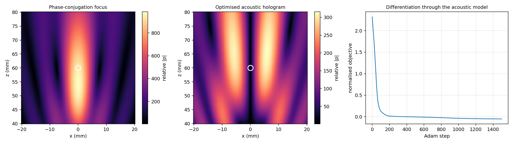

# Differentiable Physical Control Lab

A compact, auditable **JAX** repository with two differentiable-physics experiments:

1. trajectory optimisation and model-based feedback on a nonlinear Duffing-type dynamical system; and
2. a simplified single-sided acoustic-holography benchmark in which transducer phases are optimised through an acoustic field model and the Gor'kov radiation-force potential.

The repository is intentionally small enough to inspect end to end. It is a methods demonstrator, not a validated model of a specific laboratory rig and not a hardware-control implementation.

## Experiment 1 - nonlinear trajectory optimisation and feedback

The first experiment uses a two-dimensional force-actuated Duffing-type oscillator. JAX differentiates through the numerical rollout while Adam refines a bounded two-axis open-loop force sequence. A nominal-model feed-forward + PD state-feedback controller provides a transparent comparison.

On the nominal model, the optimised open-loop sequence has slightly lower tracking error and composite objective. Across a deterministic 18-case mass/damping/stiffness mismatch grid, the feedback reference has lower RMSE in every sampled case.

| Metric | Stored reference value |
|---|---:|
| Differentiable open-loop tracking RMSE | 0.0670 |
| Model-based feedback tracking RMSE | 0.0715 |
| Open-loop mismatch median RMSE | 0.1171 |
| Feedback mismatch median RMSE | 0.0740 |
| Open-loop sampled maximum mismatch RMSE | 0.1836 |
| Feedback sampled maximum mismatch RMSE | 0.1158 |
| Parameter-mismatch cases | 18 |

The result is deliberately narrow: it demonstrates a nominal-performance/model-mismatch trade-off for this benchmark. It is not a robust-control guarantee and does not show that either architecture is universally superior.

<p align="center">
  
</p>

<p align="center">
  
</p>

## Experiment 2 - simplified differentiable acoustic holography

The second experiment uses an **8 x 8 single-sided 40 kHz phased array** in air. Each transducer is represented by an isotropic point source; the complex pressures are superposed and a small-particle Gor'kov potential is evaluated at a requested target 60 mm above the array. The default particle radius is 0.3 mm, giving `ka ~= 0.22` in the model.

The optimisation variable is the vector of 64 transducer phases. The objective combines:

- a low-pressure target term;
- a penalty on non-zero acoustic radiation force at the requested target; and
- a reward for the weakest **principal stiffness**, obtained from the eigenvalues of the full spatial Hessian of the Gor'kov potential.

This is stricter than checking only the three diagonal Hessian entries: the local curvature test is positive definite only when all principal stiffnesses are positive.

The stored v0.3.0 reference run gives:

| Quantity at requested target | Phase-conjugation focus | Optimised hologram |
|---|---:|---:|
| Pressure magnitude (model units) | 945.31 | **0.798** |
| Minimum principal stiffness (model units) | -1.50e-6 | **+7.75e-8** |
| Positive-definite Gor'kov Hessian | no | **yes** |
| Acoustic-force norm relative to focus | 1.0 | **5.97e-4** |
| Linearised equilibrium offset | 4.62 mm | **5.26 um** |

The requested point is therefore a low-pressure, locally restoring **near-equilibrium** in this simplified acoustic-radiation-force model. The pressure magnitude is about 1.18e3 times lower than at the phase-conjugation focus. The x-z field slice shows a twin-lobed structure around the low-pressure region, qualitatively consistent with the twin-trap family reported for single-sided acoustic arrays.

<p align="center">
  
</p>

The experiment is inspired by the single-sided acoustic-trapping framework of Marzo et al., *Nature Communications* **6**, 8661 (2015), DOI: `10.1038/ncomms9661`. It is **not** a reproduction of that hardware model: this repository uses isotropic point sources rather than calibrated piston directivity and does not include gravity, reflections, streaming, transducer calibration, phase quantisation, particle back-scattering, or measured apparatus data.

Accordingly, the repository does **not** claim physical levitation, hardware stability, calibrated pressure/stiffness values, or real-time control. It demonstrates differentiable phase optimisation through a transparent physics model.

## What is implemented

- JAX nonlinear physical simulation;
- automatic differentiation through numerical physics;
- Adam optimisation of a bounded open-loop control sequence;
- smooth component-wise actuator saturation;
- effort and slew regularisation;
- nominal-model feed-forward + PD state feedback;
- deterministic gain selection for the feedback reference;
- an 18-case plant-parameter mismatch sweep;
- single-sided phased-array pressure superposition;
- Gor'kov small-particle potential and acoustic radiation force;
- full spatial Hessian and principal-stiffness evaluation;
- seeded Adam optimisation of 64 acoustic phases;
- numerical, physical and scientific-output validators;
- GitHub Actions across Python 3.11-3.13, with end-to-end reference benchmarks on Python 3.11.

## Quick start

The package requires Python 3.11 or newer. Python 3.11 is the recorded reference environment for the v0.2.1 nonlinear-control release; CI checks supported Python versions from 3.11 through 3.13.

```bash
python3.11 -m venv .venv
source .venv/bin/activate
python -m pip install --upgrade pip
python -m pip install -e '.[dev]'

ruff check .
pytest -q

python scripts/run_demo.py --output-dir validation_runs/control
python scripts/validate_outputs.py validation_runs/control

python scripts/run_acoustic_demo.py --output-dir validation_runs/acoustic
python scripts/validate_acoustic_outputs.py validation_runs/acoustic
```

The committed `products/` directory stores reference outputs. Use a `validation_runs/` directory for independent reproduction so the committed products are not overwritten.

## Models in brief

### Duffing-type plant

For position vector **x**,

```text
m x_ddot + c x_dot + k x + alpha ||x||^2 x = u
```

with state `[x, y, vx, vy]`. The cubic restoring term makes the dynamics nonlinear while retaining an analytic mechanical-energy function. Each applied control component is smoothly bounded with a `tanh` actuator map. See [`docs/MODEL_ASSUMPTIONS.md`](docs/MODEL_ASSUMPTIONS.md) for the exact information pattern and numerical assumptions.

### Acoustic benchmark

For a phase vector `phi`, the simplified pressure field is the coherent sum of isotropic point-source contributions. The Gor'kov potential `U` is computed from complex pressure and its spatial derivatives. The model radiation force is

```text
F_acoustic = -grad(U)
```

and the local curvature is assessed from the eigenvalues of `Hessian(U)`. Positive eigenvalues in all three principal directions indicate a locally restoring Gor'kov potential; a separate force penalty drives the requested target close to a stationary point.

Because gravity is omitted, this criterion is a **local acoustic trapping criterion inside the model**, not a claim of levitation against weight.

## Validation

The repository has **23 tests**: 13 for the nonlinear-control experiment and 10 for the acoustic module. They cover physical invariants, gradients, numerical behaviour, array geometry, small-`ka` applicability, Hessian finite-difference agreement, deterministic seeded optimisation, positive-definite local curvature, pressure-node formation and near-equilibrium force balance.

The two generated-product validators add higher-level checks after complete benchmark runs.

See:

- [`docs/VALIDATION.md`](docs/VALIDATION.md) - what the tests and stored results establish;
- [`docs/MODEL_ASSUMPTIONS.md`](docs/MODEL_ASSUMPTIONS.md) - scientific scope and omitted physics;
- [`docs/REPRODUCIBILITY.md`](docs/REPRODUCIBILITY.md) - environments and reproduction procedure.

## What is not claimed

This repository does **not** claim:

- laboratory or hardware validation of the acoustic model;
- calibrated acoustic pressure, force or stiffness values;
- levitation against gravity;
- measured transducer directivity or apparatus fidelity;
- acoustic streaming, nonlinear acoustics, scattering or reflections;
- hardware-in-the-loop operation or real-time timing guarantees;
- formal closed-loop stability or robust-control guarantees;
- reinforcement-learning capability;
- global optimality of either Adam optimisation problem;
- universal superiority of open-loop optimisation or feedback control.

## Repository map

```text
src/physctrl/dynamics.py          nonlinear Duffing-type plant and integration
src/physctrl/control.py           trajectory objective, optimisation, feedback
src/physctrl/experiment.py        target, mismatch sweep, benchmark orchestration
src/physctrl/acoustic.py          phased-array field, Gor'kov model, phase optimisation
scripts/run_demo.py               nonlinear-control reference experiment
scripts/validate_outputs.py       nonlinear generated-product validator
scripts/run_acoustic_demo.py      acoustic-hologram reference experiment
scripts/validate_acoustic_outputs.py acoustic generated-product validator
scripts/check_source_tree.py      release-tree hygiene check
scripts/check_package_metadata.py installed-package metadata check
tests/                            numerical and physical regression tests
products/                         deterministic reference metrics and figures
docs/                             assumptions, validation and reproducibility
.github/workflows/ci.yml          automated compatibility and benchmark workflow
```

## Licence

MIT. Dependencies retain their own licences; they are installed rather than vendored.
