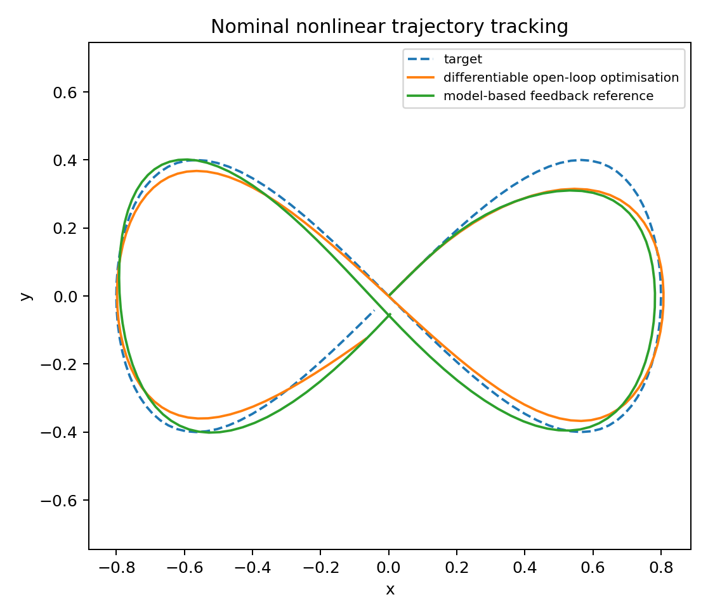
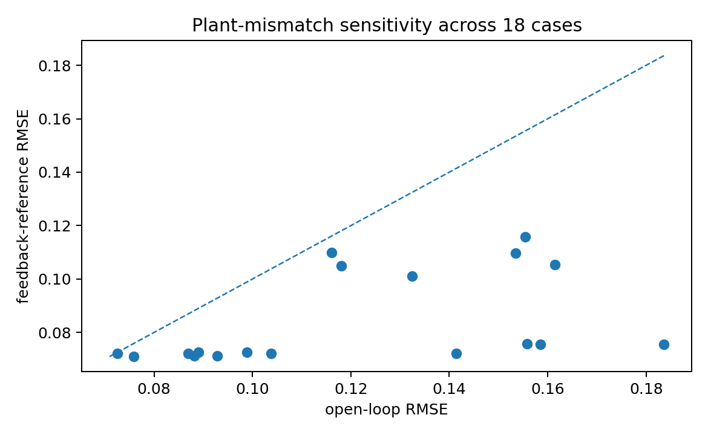

# Differentiable Physical Control Lab

A compact, auditable **JAX** benchmark for differentiable trajectory optimisation and model-based feedback on a bounded nonlinear dynamical system.

The plant is a two-dimensional force-actuated **Duffing oscillator**. The project is deliberately small enough to inspect end to end while still exposing the ingredients that matter in scientific control problems: nonlinear physics, differentiable simulation, constrained actuation, trajectory optimisation, state feedback, model mismatch, validation, and reproducibility.

> **Scope:** this is a methods benchmark. It is not an acoustic-levitation model, not a model of any specific experimental system, and not a hardware-control demonstration.

## Main result

On the nominal model, gradient-based open-loop optimisation gives slightly lower tracking error and a lower composite objective than the tuned model-based feedback reference. Under deliberate mass, damping, and stiffness mismatch, the fixed open-loop sequence degrades more strongly, while state feedback remains substantially more robust.

| Metric | v0.2.1 reference value |
|---|---:|
| Differentiable open-loop tracking RMSE | 0.0670 |
| Model-based feedback tracking RMSE | 0.0715 |
| Open-loop mismatch median RMSE | 0.1171 |
| Feedback mismatch median RMSE | 0.0740 |
| Open-loop sampled maximum mismatch RMSE | 0.1836 |
| Feedback sampled maximum mismatch RMSE | 0.1158 |
| Parameter-mismatch cases | 18 |

The comparison is intentionally **not** presented as evidence that one controller is universally superior. It illustrates a standard physical trade-off: a trajectory optimised against a nominal differentiable model can perform very well on that model, while closed-loop state feedback can better reject model error.

<p align="center">
  
</p>

<p align="center">
  
</p>

## What is implemented

- nonlinear physical simulation in **JAX**;
- automatic differentiation through the complete numerical rollout;
- Adam optimisation of an **open-loop** two-axis force sequence;
- smooth per-component actuator saturation;
- control-effort and force-slew regularisation;
- nominal-model feed-forward plus **PD state feedback**;
- deterministic gain selection for the feedback reference using the same nominal objective;
- an 18-case mass/damping/stiffness mismatch grid;
- explicit nominal-versus-mismatch comparison;
- numerical, physical, optimisation, and constraint tests;
- deterministic metrics and publication-style diagnostic plots;
- a GitHub Actions workflow for linting, testing, and an end-to-end benchmark run.

## Model

For position vector **x**, the simulated plant is

```text
m x_ddot + c x_dot + k x + alpha ||x||^2 x = u
```

with state `[x, y, vx, vy]`. The cubic restoring term makes the dynamics nonlinear while retaining an analytic mechanical-energy function that can be used for validation.

Each commanded force component is smoothly bounded as

```text
u = u_max * tanh(raw_control / u_max)
```

and the trajectory objective combines position-tracking error, applied-force effort, and force slew. Gradients are obtained with JAX automatic differentiation through a semi-implicit Euler rollout.

The comparison controller uses the nominal Duffing model to compute feed-forward force from a **predefined reference trajectory and its precomputed kinematics**, then adds proportional position-error and derivative velocity-error feedback using the current simulated state. The state-feedback term is closed loop; the benchmark does not claim that the known reference trajectory itself is generated causally online.

## Quick start

The v0.2.1 reference run and CI target **Python 3.11**, and the package metadata requires Python 3.11 or newer. Python 3.11 is the environment validated end to end for this release.

```bash
python3.11 -m venv .venv
source .venv/bin/activate
python -m pip install --upgrade pip
python -m pip install -e '.[dev]'

ruff check .
pytest -q
python scripts/run_demo.py
```

On Windows, activate the environment with `.venv\\Scripts\\activate` instead.

The benchmark writes reproducible outputs to `products/`:

- `metrics.json` — headline numerical results;
- `robustness_cases.json` — all 18 parameter-mismatch cases;
- `trajectory.png` — nominal target tracking;
- `optimisation_history.png` — objective convergence;
- `robustness.png` — mismatch-error comparison;
- `worst_case_comparison.png` — trajectory behaviour in the worst open-loop mismatch case.

To inspect the headline metrics:

```bash
python -m json.tool products/metrics.json
```

To validate without overwriting the committed reference products, use:

```bash
python scripts/run_demo.py --output-dir validation_runs/manual
```

## Validation

The tests and benchmark check more than whether the code executes. They cover:

- bounded actuator components;
- preservation of the zero equilibrium under zero input;
- mechanical-energy decay for the unforced damped system;
- timestep-refinement behaviour;
- malformed-input rejection;
- finite autodiff gradients;
- finite single-step objectives;
- reduction of the nominal optimisation objective from its warm start;
- bounded optimised force;
- closed-loop response under plant mismatch;
- complete and finite evaluation of the 18-case mismatch grid.

The mismatch grid varies:

- mass by factors `0.85, 1.00, 1.15`;
- damping by factors `0.75, 1.00, 1.25`;
- linear stiffness by factors `0.90, 1.10`.

See [`docs/VALIDATION.md`](docs/VALIDATION.md) for the validation logic and [`docs/MODEL_ASSUMPTIONS.md`](docs/MODEL_ASSUMPTIONS.md) for the scientific limitations.

## What is not claimed

This repository does **not** claim:

- acoustic-radiation-force or acoustic-field fidelity;
- modelling of a transducer array or experimental apparatus;
- hardware-in-the-loop or laboratory validation;
- real-time control performance;
- reinforcement learning;
- a learned surrogate or neural dynamics model;
- robust optimisation or a formal robust-control guarantee;
- universal superiority of the optimised open-loop sequence over feedback control.

The open-loop optimiser has access to the complete target trajectory. The feedback reference uses the same known reference through precomputed kinematics and current-state feedback. The comparison is therefore a controlled methods benchmark, not a contest between information-matched production controllers.

## Repository map

```text
src/physctrl/dynamics.py     nonlinear plant, actuator map, integration, energy
src/physctrl/control.py      objective, autodiff optimisation, feedback reference
src/physctrl/experiment.py   target, mismatch sweep, metrics, benchmark orchestration
tests/                       numerical and physical regression tests
products/                    deterministic reference metrics and figures
docs/                        assumptions, validation, reproducibility
.github/workflows/ci.yml     automated hygiene/metadata/lint/test/demo workflow
scripts/check_source_tree.py     frozen-tree hygiene check
scripts/check_package_metadata.py installed-package metadata check
scripts/validate_outputs.py     generated-product/scientific-behaviour check
```

## Reproducibility and interpretation

The benchmark contains no random sampling in the optimiser, gain search, target construction, or mismatch grid. Small floating-point differences can still occur across JAX/XLA versions and hardware. The tests therefore focus on numerical and physical properties rather than requiring exact agreement in the last decimal place.

See [`docs/REPRODUCIBILITY.md`](docs/REPRODUCIBILITY.md) for the environment and reproduction notes.

## Purpose

This repository is a portfolio-scale scientific-computing demonstrator: one inspectable example connecting a first-principles nonlinear model, differentiable numerical simulation, gradient-based optimisation, feedback control, actuator constraints, model-mismatch analysis, automated tests, and reproducible outputs.

It is **not** presented as a publication, an acoustic-levitation implementation, or a production controller.

## License

The project source is released under the MIT License. Third-party Python dependencies are
installed separately and retain their own licenses; no third-party source code is vendored in
this repository.
